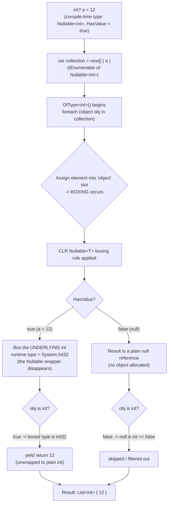

# The Case of the Vanishing `Nullable<T>`: Why `OfType<T>` Beats `OfType<T?>` on a Collection of Nullables
 
*Boxing, unboxing, and one of the most counter-intuitive corners of C#*
 
## The line of code that started it all
 
While reviewing a status-aggregation method, I hit a LINQ projection that made me stop and stare:
 
```csharp
return idList
    .ToDictionary(
        id => id,
        id => statusesById[id].SelectMany(x => x.ChildStatuses)
            .Concat(statusesById[id].Select(x => x.PrimaryStatus).OfType<ItemStatus>())
            .Concat(statusesById[id].Select(x => x.SecondaryStatus).OfType<ItemStatus>())
            .ToList());
```
 
The interesting part is the two `Concat` calls. Look at where `PrimaryStatus` and `SecondaryStatus` come from:
 
```csharp
PrimaryStatus = x.Source.PrimaryRequest != null
                    ? (ItemStatus?)x.Source.PrimaryRequest.Status
                    : null,
SecondaryStatus = x.Source.SecondaryRequest != null
                    ? (ItemStatus?)x.Source.SecondaryRequest.Status
                    : null
```
 
Both are `ItemStatus?` — that is, `Nullable<ItemStatus>`. So the projection produces:
 
```csharp
IEnumerable<ItemStatus?>
```
 
And then we call:
 
```csharp
.OfType<ItemStatus>()   // note: NOT OfType<ItemStatus?>()
```
 
My gut reaction: *"That's wrong. The elements are `Nullable<ItemStatus>`, not `ItemStatus`. This should filter out everything and return an empty list."*
 
My gut was wrong. And understanding **why** is a genuinely useful trip through how the CLR handles value types.
 
---
 
## First, a quick refresher: boxing and unboxing
 
C# has two families of types:
 
- **Value types** — `int`, `bool`, `enum`, `struct`, and `Nullable<T>`. These live on the stack or inline inside other objects.
- **Reference types** — `class`, `object`, `string`. These live on the heap and you hold a reference to them.
 
**Boxing** is the act of taking a value type and wrapping it in a heap object so it can be treated as an `object`:
 
```csharp
int i = 5;
object boxed = i;      // boxing: a heap object of runtime type System.Int32 is allocated
```
 
**Unboxing** is pulling the value back out, and it requires the runtime type to match exactly:
 
```csharp
int j = (int)boxed;    // unboxing
```
 
Crucially, a boxed value **remembers its own runtime type**. That's what makes the `is` operator and `OfType<T>` able to test it later.
 
---
 
## The twist: there is no such thing as a boxed `Nullable<T>`
 
Here's the rule that surprises almost everyone, and it's baked directly into the CLR's boxing instruction:
 
> When you box a `Nullable<T>`:
> - If it **has a value**, the CLR boxes the **underlying `T`** — *not* the `Nullable<T>` wrapper. The heap object's runtime type is `T` (e.g. `System.Int32`), not `Nullable<Int32>`.
> - If it is **null** (`HasValue == false`), the result is simply a **`null` reference**. No object is allocated at all.
 
In other words: **the `Nullable<T>` envelope evaporates the instant it's boxed.** You can never get a heap object whose runtime type is `Nullable<T>`. You only ever end up with a boxed `T`, or a plain `null`.
 
Let's prove it:
 
```csharp
int? x = 42;
object boxedX = x;                    // the Nullable<int> wrapper is gone
Console.WriteLine(boxedX.GetType());  // System.Int32   (NOT Nullable`1)
 
int? y = null;
object boxedY = y;                    // just null
Console.WriteLine(boxedY is null);    // True
```
 
`boxedX.GetType()` returns `System.Int32`. Not `System.Nullable<System.Int32>`. The type identity you carefully declared at compile time is *not* preserved through boxing.
 
This symmetry is also why unboxing is flexible — a boxed `int` can be unboxed into either `int` or `int?`:
 
```csharp
object boxed = 42;      // boxed Int32
int a  = (int)boxed;    // ok
int? b = (int?)boxed;   // also ok — the runtime rebuilds the Nullable
```
 
---
 
## So where does the boxing even happen in `OfType<T>`?
 
Here's the part that ties the room together. Look at how `OfType<TResult>` is actually implemented:
 
```csharp
public static IEnumerable<TResult> OfType<TResult>(this IEnumerable source)
{
   foreach (object? obj in source)   // <-- element is viewed as 'object'
       if (obj is TResult result)
           yield return result;
}
```
 
Two things matter here:
 
1. **`OfType` iterates over the non-generic `IEnumerable`, so each element lands in an `object` slot.** The moment a value type (`ItemStatus?`) is assigned to that `object` variable, it is **boxed**. This is the step that physically triggers boxing.
 
2. **The `is TResult` check then tests that already-boxed reference's runtime type.** It's the reason the check exists at all — but it operates on a reference whose `Nullable<T>` identity has *already* been stripped away by step 1.
 
This is worth emphasizing because `is` doesn't *always* box. If the compiler knows both static types up front — `int? s; if (s is int)` — it lowers to a plain `HasValue` check with zero allocations. But inside `OfType<T>`, the element has already been widened to `object`, so boxing is unavoidable, and the `Nullable<T>` unwrapping rule kicks in.
 
---
 
## Walking a single element through the machine
 
Let's trace `int? a = 12` through `OfType<int>()`, exactly like we did in the session:
 
```csharp
int? a = 12;
var collection = new[] { a };          // IEnumerable<int?>
var result = collection.OfType<int>().ToList();
```
 

 
The punchline: even though `a` genuinely **is** a `Nullable<int>` in your source code, by the time `is int` runs, the value on the heap is a plain `System.Int32`. So it matches. And a null element boxes to a `null` reference, which fails `is int`, so it's dropped.
 
**`OfType<int>()` on a collection of `int?` is effectively a "remove nulls and unwrap" operation.**
 
---
 
## Now the counter-intuitive part, spelled out
 
Bring it back to the code sample. We have:
 
```csharp
IEnumerable<ItemStatus?> source = /* primary/secondary request statuses */;
```
 
### Option A — `OfType<ItemStatus>()` (the non-nullable one, used in the code)
 
- Non-null elements box to `ItemStatus` → `is ItemStatus` is **true** → **kept and unwrapped**.
- Null elements box to `null` → `is ItemStatus` is **false** → **dropped**.
- **Result: a `List<ItemStatus>` of exactly the real statuses.** ✅
 
### Option B — `OfType<ItemStatus?>()` (the nullable one, the "intuitive" choice)
 
You'd think matching the *declared* element type is the correct, safe thing to do. But `TResult` here is a `Nullable<T>`, and there's a special-case detail: for a nullable target, the check still ultimately tests against the underlying boxed `T`, so the **non-null values are kept** — while the **nulls remain nulls in the output**. You end up with a `List<ItemStatus?>` that still contains `null` entries you now have to deal with downstream.
 
So the "obviously correct" `OfType<ItemStatus?>()` gives you a *worse* result (nulls leak through), and the "obviously wrong" `OfType<ItemStatus>()` gives you exactly what you want (clean, non-null, unwrapped values).
 
That's the counter-intuition in one sentence:
 
> **With a `collection<Nullable<T>>`, it's `OfType<T>` — not `OfType<Nullable<T>>` — that returns the meaningful values, because boxing has already erased the `Nullable<T>` identity before the type test ever runs.**
 
Your mental model says "the collection is of `Nullable<T>`, so I should ask for `Nullable<T>`." The CLR's model says "there is no such thing as a boxed `Nullable<T>` — there's only boxed `T` or `null` — so ask for `T`."
 
---
 
## Why the language designers did this (it's not an accident)
 
This behavior is deliberate and, once you accept it, quite elegant:
 
- **It makes `null` behave like `null`.** A null `Nullable<T>` boxing to a real `null` reference means nullable value types interoperate cleanly with reference-type null semantics (dictionaries, `object` APIs, reflection, serialization).
- **It avoids a useless double-wrapper.** A "boxed `Nullable<T>` that has no value" would be a non-null heap object representing nothing — the worst of both worlds. Collapsing it to `null` is far more sensible.
- **It keeps unboxing symmetric.** One boxed `int` can serve both `int` and `int?` consumers.
 
The cost of that elegance is exactly the head-scratcher we ran into: type identity through boxing is about the *underlying* type, not the *declared* type.
 
---
 
## Practical takeaways
 
1. **`OfType<T>()` over `IEnumerable<T?>` is a legitimate, idiomatic "filter nulls + unwrap" idiom.** The original code was correct all along.
2. **Boxing erases `Nullable<T>`.** After boxing you have a boxed `T` or a `null` — never a boxed `Nullable<T>`. `x.GetType()` will confirm it: `System.Int32`, not `Nullable<Int32>`.
3. **`is` only boxes when the element has been widened to `object`.** With concrete static types, the compiler optimizes it into a `HasValue` check — no allocation.
4. **When in doubt, write the tiny experiment.** A five-line console snippet or a unit test settles these arguments faster than any debate.
5. **Watch the performance angle.** Because `OfType` on value types boxes every element, in hot paths a `.Where(x => x.HasValue).Select(x => x.Value)` avoids the boxing entirely and can be cheaper — though it's noisier to read.
 
---
 
## Closing thought
 
The most valuable bugs-that-aren't are the ones that force you to reconcile your mental model with what the runtime actually does. `OfType<ItemStatus>()` on a sequence of `ItemStatus?` *looks* wrong, feels wrong, and is completely right — because somewhere between your `foreach` and your `is`, the `Nullable<T>` you were so sure about quietly boxed itself out of existence.
 
Next time you see `OfType<T>()` on a collection of `T?`, you'll know: that's not a bug. That's the CLR doing exactly what it was designed to do.
 
---
 
*If you want to see this in action, drop a couple of `xUnit` tests next to your resolver: one asserting `OfType<T>()` strips the nulls, and one showing `OfType<T?>()` keeps them. The green bar is a surprisingly satisfying way to end the debate.*
